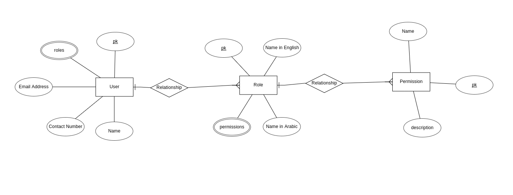
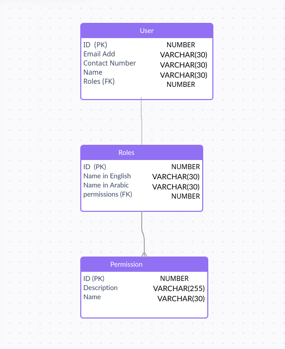

## 3- Write an ER diagram for the case below :

A system has three main objects: User, Role, and permission.

+ Every User has the following attributes: Name, Contact Number, and Email Address.

+ Every Role has the following attributes: Name in Arabic, Name in English.

+ Every Permission has the following attributes: Name and description.

**User Can have a 0 or 1 or more Roles, For example, Ali can have the roles :**

QA Team Leader, and QA Engineer. While Dana has the Role: "Software Engineer"

Every Role has 1 or more Permissions, For example, QA Engineer has the permissions: "QA Assurance" and "Release Management"

Hint: Different users could have the same role.

You need to write an ER-Diagram that has all the needed tables to support this system. The Diagram should contain every table and its columns and their types, primary keys (If exists), and indexes (if exist). The ER- diagram also should have the relationships between the tables. (one to one, one to many, ....)

## solutoin

